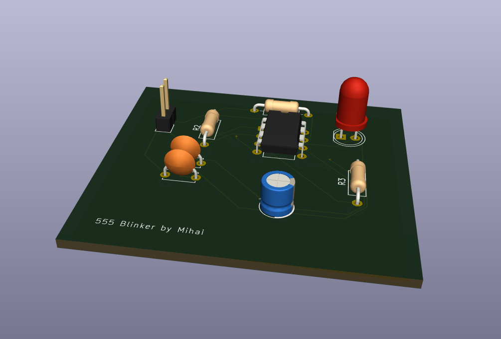
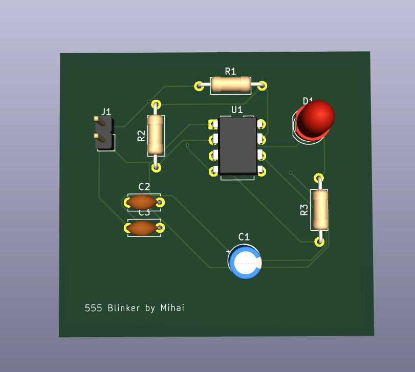
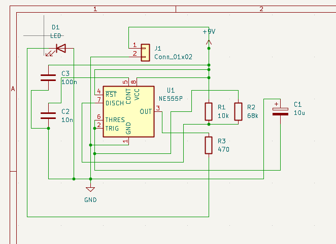

# 555 Timer LED Blinker

A simple astable 555 timer circuit that blinks an LED at about 1 Hz,
designed in KiCad as my first PCB project.

## Overview
- 2-layer through-hole PCB, 50 x 40 mm
- Powered by a 9V battery
- Blink frequency: f = 1.44 / ((R1 + 2·R2) · C1) ≈ 1 Hz

## Schematic

## Bill of Materials
| Ref | Value | Footprint |
|-----|-------|-----------|
| U1 | NE555P | DIP-8 |
| R1 | 10k | Axial 0207 |
| R2 | 68k | Axial 0207 |
| R3 | 470 | Axial 0207 |
| C1 | 10µF electrolytic | Radial D5.0 |
| C2 | 10nF | Disc 5mm |
| C3 | 100nF | Disc 5mm |
| D1 | Red LED | 5mm |
| J1 | 2-pin header | 2.54mm |

## How it works
C1 charges through R1 and R2 and discharges through R2. The 555 switches
its output when C1 reaches 1/3 and 2/3 of the supply voltage.

## What I learned
- Schematic capture, footprint assignment, and ERC
- 2-layer PCB layout, routing, and ground pour

